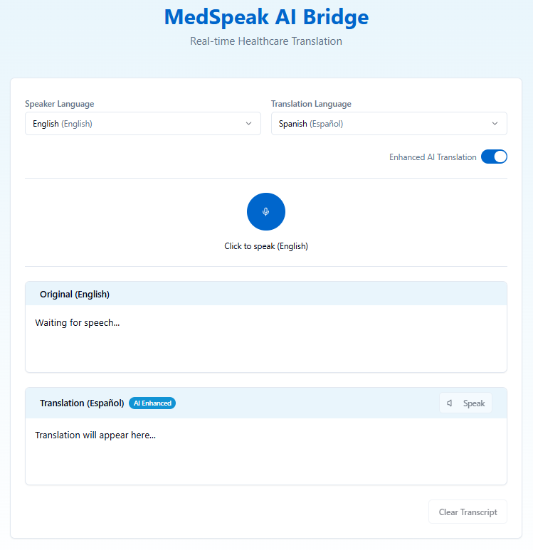

# MedSpeak AI Bridge - Healthcare Translation Web App

A real-time multilingual translation platform designed specifically for healthcare providers to communicate with patients across language barriers, with specialized support for medical terminology.

## Key Features

- **Accurate Speech-to-Text**: Real-time transcription with medical term recognition
- **AI-Powered Translation**: Specialized medical translations in 12 languages
- **Dual Interface**: Side-by-side original/translated text display
- **Audio Playback**: Listen to translations in native pronunciation
- **Secure & Private**: All processing happens client-side (optional server enhancement)
- **Mobile-Optimized**: Fully responsive for clinic or bedside use

## Supported Languages

🇬🇧 English | 🇪🇸 Spanish | 🇫🇷 French | 🇩🇪 German  
🇨🇳 Chinese | 🇯🇵 Japanese | 🇦🇪 Arabic | 🇵🇹 Portuguese  
🇷🇺 Russian | 🇮🇳 Hindi | 🇮🇹 Italian | 🇰🇷 Korean  

## Usage Guide

1. **Recording**:
   - Click the microphone icon to start speaking
   - Select input language from dropdown

2. **Translation**:
   - Select target language from dropdown

3. **Playback**:
   - Click the speaker icon to hear the translation